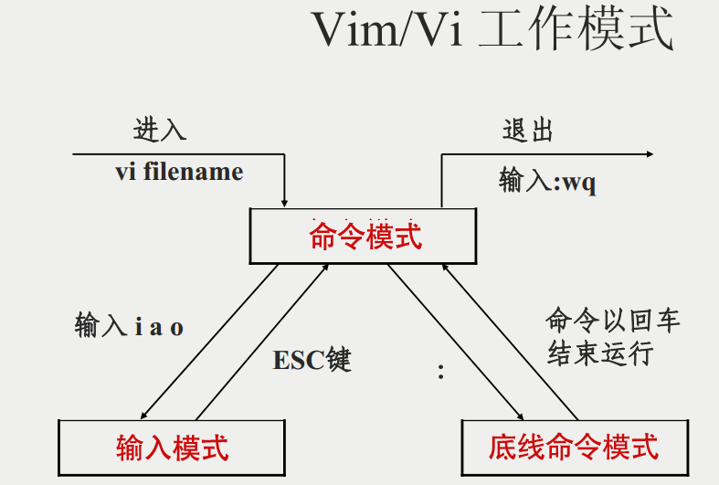

## vim

vim是一个类似vi编辑器的。有一个段子：程序员分为三类，一种是用`vim`的 一种是用`emacs` ,剩下的一种是用其他编辑器的。可见vim的流传度。vim的设计理解，是命令的组合。就是完全不用鼠标。通过命令就可以。比如我们在其他编辑器。如果跑到多少行，我们可能需要滚动鼠标。但是vim就在命令行模式下就完成了。先上一个图

 

### VIM的模式

vim的模式有三种：分别为命令模式，输入模式、尾行模式

 

#### 1. 命令模式

默认用vim打开一个文件的时候，就是进入了命令模式。在这个模式下。可以通过各种命令组合操作文本编辑器

#### 2. 输入模式

输入模式，就是和我们正常的编辑器一样。可以在这个模式下。编辑修改打开文件的内容

在命令模式下。按`i`键。就是输入模式。按`ESC` 退出输入模式，进入到命令模式

#### 3. 尾行模式

在命令模式下`:` 进入尾行。尾行模式下命令也非常多。主要包括文件的查找，保存等

### VIM命令模式下的快捷键

介绍一些常用的快捷键。

上下左右键可能跟我们之前的不一样。一般游戏爱好者的上下左右是wsad。但是在vim就是hjkl。

| 移动光标的方法                                               |                                                              |
| ------------------------------------------------------------ | ------------------------------------------------------------ |
| h 或 向左箭头键(←)                                           | 光标向左移动一个字符                                         |
| j 或 向下箭头键(↓)                                           | 光标向下移动一个字符                                         |
| k 或 向上箭头键(↑)                                           | 光标向上移动一个字符                                         |
| l 或 向右箭头键(→)                                           | 光标向右移动一个字符                                         |
| 如果你将右手放在键盘上的话，你会发现 hjkl 是排列在一起的，因此可以使用这四个按钮来移动光标。 如果想要进行多次移动的话，例如向下移动 30 行，可以使用 "30j" 或 "30↓" 的组合按键， 亦即加上想要进行的次数(数字)后，按下动作即可！ |                                                              |
| [Ctrl] + [f]                                                 | 屏幕『向下』移动一页，相当于 [Page Down]按键 (常用)          |
| [Ctrl] + [b]                                                 | 屏幕『向上』移动一页，相当于 [Page Up] 按键 (常用)           |
| [Ctrl] + [d]                                                 | 屏幕『向下』移动半页                                         |
| [Ctrl] + [u]                                                 | 屏幕『向上』移动半页                                         |
| +                                                            | 光标移动到非空格符的下一行                                   |
| -                                                            | 光标移动到非空格符的上一行                                   |
|                                                              |                                                              |
| 0 或功能键[Home]                                             | 这是数字『 0 』：移动到这一行的最前面字符处 (常用)           |
| $ 或功能键[End]                                              | 移动到这一行的最后面字符处(常用)                             |
| H                                                            | 光标移动到这个屏幕的最上方那一行的第一个字符                 |
| M                                                            | 光标移动到这个屏幕的中央那一行的第一个字符                   |
| L                                                            | 光标移动到这个屏幕的最下方那一行的第一个字符                 |
| G                                                            | 移动到这个档案的最后一行(常用)                               |
| nG                                                           | n 为数字。移动到这个档案的第 n 行。例如 20G 则会移动到这个档案的第 20 行(可配合 :set nu) |
| gg                                                           | 移动到这个档案的第一行，相当于 1G 啊！ (常用)                |
| x, X                                                         | 在一行字当中，x 为向后删除一个字符 (相当于 [del] 按键)， X 为向前删除一个字符(相当于 [backspace] 亦即是退格键) (常用) |
| --------                                                     | ------------------------------------------------------------ |
| nx                                                           | n 为数字，连续向后删除 n 个字符。举例来说，我要连续删除 10 个字符， 『10x』。 |
| **dd**                                                       | 删除游标所在的那一整行(常用)                                 |
| **ndd**                                                      | n 为数字。删除光标所在的向下 n 行，例如 20dd 则是删除 20 行 (常用) |
| d1G                                                          | 删除光标所在到第一行的所有数据                               |
| dG                                                           | 删除光标所在到最后一行的所有数据                             |
| d$                                                           | 删除游标所在处，到该行的最后一个字符                         |
| d0                                                           | 那个是数字的 0 ，删除游标所在处，到该行的最前面一个字符      |
| **yy**                                                       | 复制游标所在的那一行(常用)                                   |
| **nyy**                                                      | n 为数字。复制光标所在的向下 n 行，例如 20yy 则是复制 20 行(常用) |
| y1G                                                          | 复制游标所在行到第一行的所有数据                             |
| yG                                                           | 复制游标所在行到最后一行的所有数据                           |
| y0                                                           | 复制光标所在的那个字符到该行行首的所有数据                   |
| y$                                                           | 复制光标所在的那个字符到该行行尾的所有数据                   |
| **p, P**                                                     | p 为将已复制的数据在光标下一行贴上，P 则为贴在游标上一行！ 举例来说，我目前光标在第 20 行，且已经复制了 10 行数据。则按下 p 后， 那 10 行数据会贴在原本的 20 行之后，亦即由 21 行开始贴。但如果是按下 P 呢？ 那么原本的第 20 行会被推到变成 30 行。 (常用) |
| J                                                            | 将光标所在行与下一行的数据结合成同一行                       |
| c                                                            | 重复删除多个数据，例如向下删除 10 行，[ 10cj ]               |
| u                                                            | 复原前一个动作。(常用)                                       |
| [Ctrl]+r                                                     | 重做上一个动作。(常用)                                       |

### 进入编辑模式的命令

- `i` i 为『从目前光标所在处输入』 insert 
- `I` I 为『在目前所在行的第一个非空格符处开始输入』 
- `a` a 为『从目前光标所在的下一个字符处开始输入』  append
- A 为『从光标所在行的最后一个字符处开始输入』。(常用) 
- `ESC` 退回到命令模式

### 尾行模式下的命令

- `:w` 将编辑的数据写入硬盘档案中 
- `:w!`若文件属性为『只读』时，强制写入该档案 
- `:q` 退出文件
- `:q!` 不保存退出
- `:wq ` 保存退出
- `:wq!` 强制保存退出

