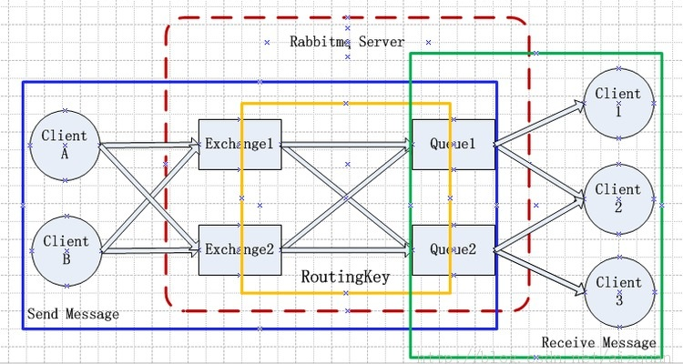
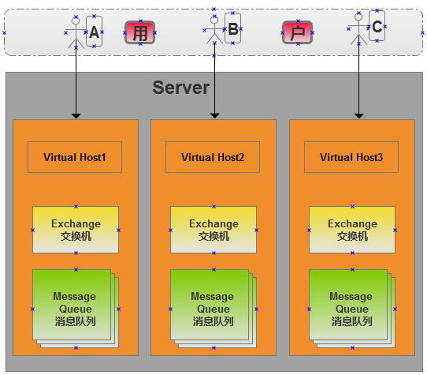
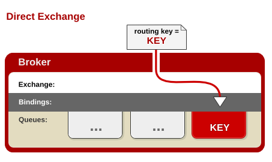
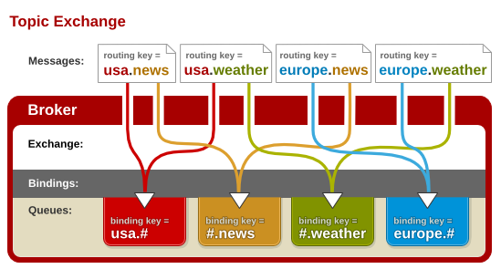

## RabbitMQ 消息队列

> RabbitMQ是流行的开源消息队列系统，用erlang语言开发，完整的实现了AMPQ（高级消息队列协议）

## AMQP协议

> AMQP，是应用层协议的一个开放标准，为面向消息的中间件设计。消息中间件主要用于组件之间的解耦，消息的发送者无需知道消息使用者的存在，同样，消息使用者也不用知道发送者的存在。AMQP的主要特征是面向消息、队列、路由（包括点对点和发布/订阅）、可靠性、安全

## 系统架构

消息队列的使用过程大概如下：

（1）客户端连接到消息队列服务器，打开一个channel。
（2）客户端声明一个exchange，并设置相关属性。
（3）客户端声明一个queue，并设置相关属性。
（4）客户端使用routing key，在exchange和queue之间建立好绑定关系。
（5）客户端投递消息到exchange。exchange接收到消息后，就根据消息的key和已经设置的binding，进行消息路由，将消息投递到一个或多个队列里

## Rabbitmq中几个概念的解释

- **生产者 **

生产者就是产生消息并向RabbitMq队列发送消息

- **消费者**

等待RabbitMq消息到来并处理消息

- **Queue**(队列)

Queue(队列), 依存于RabbitMQ内部,消息存在队列中。它指定消息按什么规则，路由到哪个队列

- **交换器(exchange)**

生产者将消息发送到Exchange（交换器），由Exchange将消息路由到一个或多个Queue中.它指定消息按什么规则，路由到哪个队列

- **binding 绑定**

它的作用就是把exchange和queue按照路由规则绑定起来

- routing key 路由关键字

exchange根据这个关键字将消息投放到对应的队列中去。

- **Binding key**

在绑定（Binding）Exchange与Queue的同时，一般会指定一个binding key；生产者将消息发送给Exchange时，一般会指定一个routing key；当binding key与routing key相匹配时，消息将会被路由到对应的Queue中

- **虚拟主机**

一个虚拟主机持有一组交换机、队列和绑定。隔离不同的队列和用户的权限管理。

-  **channel 消息通道**

在客户端的每个连接里，可建立多个channel，每个channel代表一个会话任务

-Exchange type 交换模式

RabbitMQ提供了四种Exchange模式：fanout,direct,topic,header 

一、 **Fanout**

它采取广播模式，消息进来时，将会被投递到与改交换机绑定的所有队列中。
所有发送到Fanout Exchange的消息都会被转发到与该Exchange 绑定(Binding)的所有Queue上.Fanout Exchange  不需要处理RouteKey 。只需要简单的将队列绑定到exchange

二、**Direct **

Direct模式,消息传递时，RouteKey必须完全匹配，才会被队列接收，否则该消息会被抛弃。

三. **Topic **

Exchange 将RouteKey 和某Topic 进行模糊匹配。此时队列需要绑定一个Topic。可以使用通配符进行模糊匹配，符号“#”匹配一个或多个词，符号“*”匹配不多不少一个词。因此“log.#”能够匹配到“log.info.oa”，但是“log.*” 只会匹配到“log.error