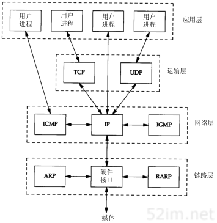
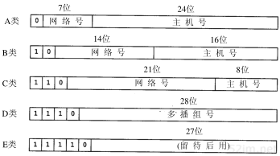
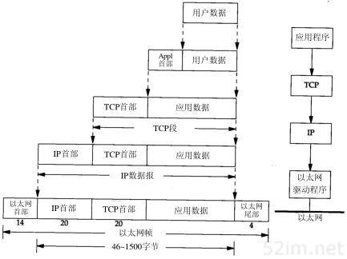
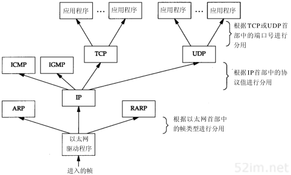

### 概述

网络协议通常分不同层次进行开发，每一层分别负责不同的通信功能。一个协议族，比如TCP/IP，是一组不同层次上的多个协议的组合。TCP/IP通常被认为是一个四层协议系统.

	

每一层负责不同的功能：

1. **链路层**，有时也称作数据链路层或网络接口层，通常包括操作系统中的设备驱动程序和计算机中对应的网络接口卡。它们一起处理与电缆（或其他任何传输媒介）的物理接口细节。
2. **网络层**，有时也称作互联网层，处理分组在网络中的活动，例如分组的选路。在TCP/IP协议族中，网络层协议包括IP协议（网际协议），ICMP协议（Internet互联网控制报文协议），以及IGMP协议（Internet组管理协议）。
3. **运输层** 主要为两台主机上的应用程序提供端到端的通信。在TCP/IP协议族中，有两个互不相同的传输协议：TCP（传输控制协议）和UDP（用户数据报协议）。
   TCP为两台主机提供高可靠性的数据通信。它所做的工作包括把应用程序交给它的数据分成合适的小块交给下面的网络层，确认接收到的分组，设置发送最后确认分组的超时时钟等。由于运输层提供了高可靠性的端到端的通信，因此应用层可以忽略所有这些细节。
   而另一方面，UDP则为应用层提供一种非常简单的服务。它只是把称作数据报的分组从一台主机发送到另一台主机，但并不保证该数据报能到达另一端。任何必需的可靠性必须由应用层来提供。
   这两种运输层协议分别在不同的应用程序中有不同的用途，这一点将在后面看到。
4. **应用层** 负责处理特定的应用程序细节。几乎各种不同的TCP/IP实现都会提供下面这些通用的应用程序：
   • Telnet远程登录。• FTP文件传输协议。• SMTP简单邮件传送协议。• SNMP简单网络管理协议。

### 互联网地址

互联网上的每个接口必须有一个唯一的Internet地址（也称作IP地址）。IP地址长32 bit。Internet地址并不采用平面形式的地址空间，如1、2、3等。IP地址具有一定的结构，五类不同的互联网地址格式如图1-5所示。

### 用户数据封装和分用

应用程序用TCP传送数据时，数据被送入协议栈中，然后逐个通过每一层直到被当作一串比特流送入网络。其中每一层对收到的数据都要增加一些首部信息（有时还要增加尾部信息），该过程如图1-7所示。TCP传给IP的数据单元称作TCP报文段或简称为TCP段（TCP segment）。IP传给网络接口层的数据单元称作IP数据报(IP datagram)。通过以太网传输的比特流称作帧(Frame)

当目的主机收到一个以太网数据帧时，数据就开始从协议栈中由底向上升，同时去掉各层协议加上的报文首部。每层协议盒都要去检查报文首部中的协议标识，以确定接收数据的上层协议。这个过程称作分用（Demultiplexing）

### 端口号

服务器一般通过端口号来识别对应的应用程序。TCP和UDP采用16 bit的端口号来识别应用程序。任何TCP/IP实现所提供的服务都用知名的1～1023之间的端口号。大多数TCP/IP实现给临时端口分配1024～5000之间的端口号。大于5000的端口号是为其他服务器预留的（Internet上并不常用的服务)

> 到1992年为止，知名端口号介于1～255之间。256～1023之间的端口号通常都是由Unix系统占用，以提供一些特定的Unix服务—也就是说，提供一些只有Unix系统才有的、而其他操作系统可能不提供的服务。现在IANA管理1～1023之间所有的端口号。

### 应用编程

TCP/IP协议的应用程序通常采用两种应用编程接口（API）：socket和TLI（运输层接口：Transport Layer Interface）